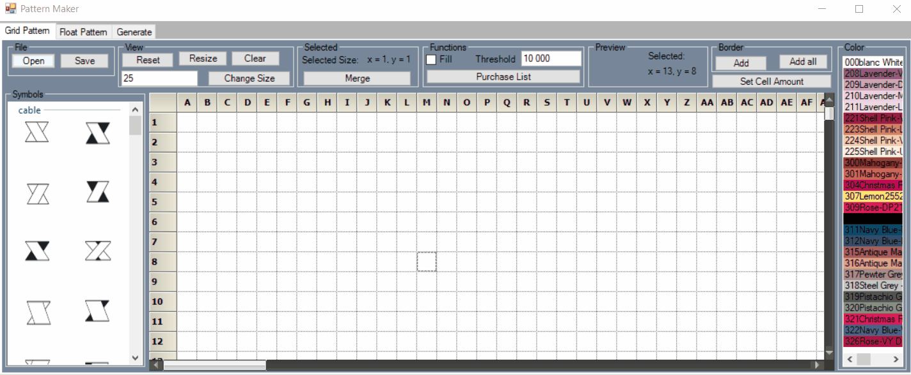
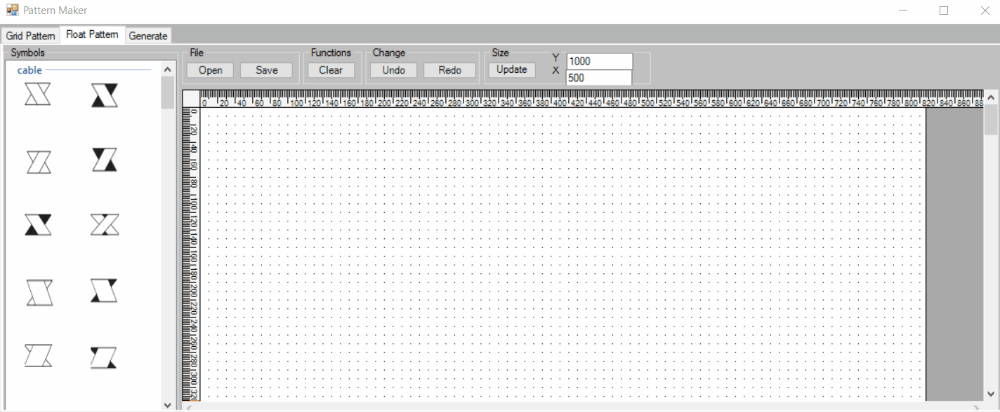

<p align="center">
  
</p>


# About
Patterns maker is a `windows form` application with the main purpose to simplify and manage the creation of crochet, knitting, embroidery, stitching patterns. Patterns maker lets the user create patterns in either a gridcontrol or in a flowchart. The implementation is written in `C#`.

# Syncfusion
To simplify the implementation of a gridcontrol and flowchart i chose to use licensed nuget packages from Syncfusion.

Syncfusion was founded in 2001 and headquartered in Research Triangle Park, N.C., Syncfusion has more than 13,000 customers and more than 1 million users, including large financial institutions, Fortune 500 companies, and global IT consultancies.

Today they provide 800+ controls and frameworks for web, mobile, and desktop development. We provide ready-to-deploy enterprise software for dashboards, reports, data integration and big data processing. Many customers have saved millions in licensing fees by deploying our software.

# How-To
This part explains how to start, install and use this program.

## Install
Clone or download this repo:
```
git clone git@github.com:grebtsew/Patterns-Maker.git
```

To open and change code install Visual Studio 2019, and load the project file.

## Start
Load the project file in Visual Studio 2019 and run the program.

## GridControl
All colors in the gridcontrol view are dmc colors for embroidery.

See GridControl demo below:


## FlowChart
See FlowChart demo below:


## Generator
See Generator demo below:


# Know Issues
This is a list of know issues which will be handled when I have time. Please let me know if you find any issues or need more functions within the implementation.

* `Windows Forms` are an outdated technology and my plan is to implement the same program in `mvc` application.
* Everything in this program is single threaded, which means the program will freeze when you run a function. This could be easily fixed with multithreading and delegate functions.

# License
This project utilizes the 

